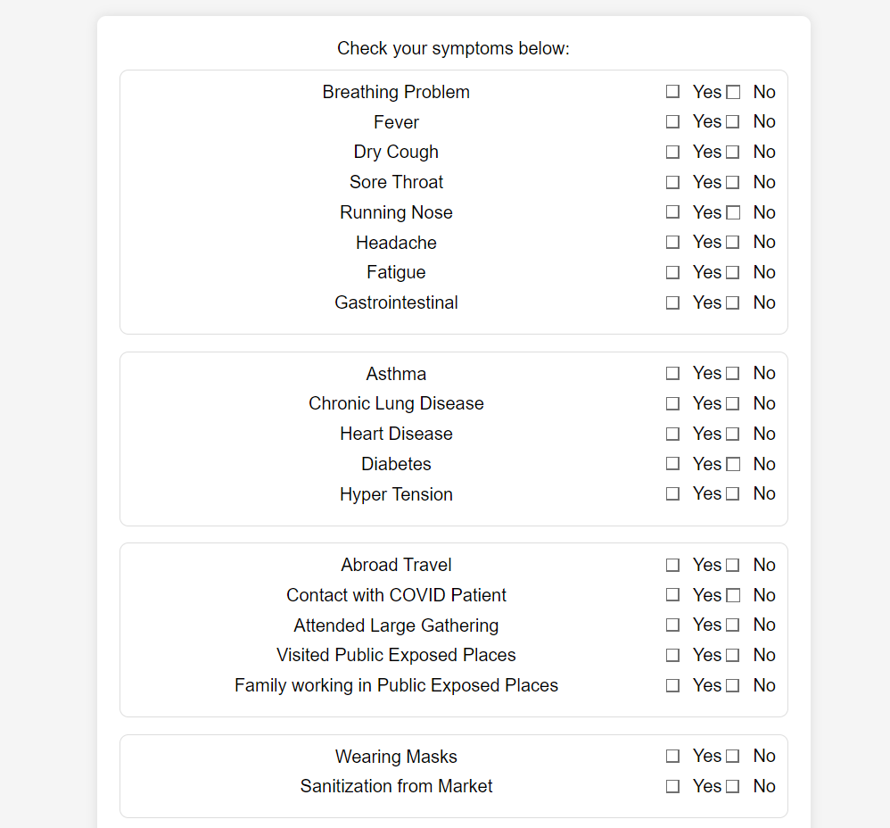
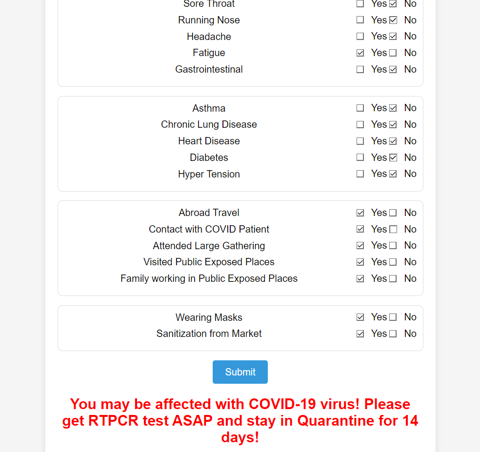

# COVID-19 Symptom Checker

 This is a simple web application built using Flask that predicts the likelihood of a person having COVID-19 based on provided symptoms and conditions.

## Prerequisites

Before you begin, ensure you have met the following requirements:
```bash
pip install -r requirements.txt
```
## Usage

1. Run the Flask application:

    ```bash
    python app.py
    ```

2. Open your web browser and go to [http://localhost:8080/](http://localhost:8080/)

3. Fill out the form with the symptoms and conditions, and click the "Submit" button.

4. The application will display the predicted result based on the trained machine learning model.

# File Structure

- **app.py:** Main Flask application file containing the routes and logic.
- **model.pkl:** Pickle file containing the trained machine learning model.
- **label_encoder.pkl:** Pickle file containing the LabelEncoder used for encoding categorical features.
- **templates/:** Folder containing HTML templates for the web application.


 ## Screenshots

### Home Page

*Screenshot of the COVID-19 Symptom Checker home page where users can input their symptoms for prediction.*

### Prediction Result

*Illustration of the prediction result page displaying the outcome of the COVID-19 likelihood based on the entered symptoms.*
